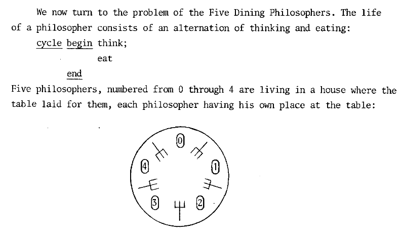
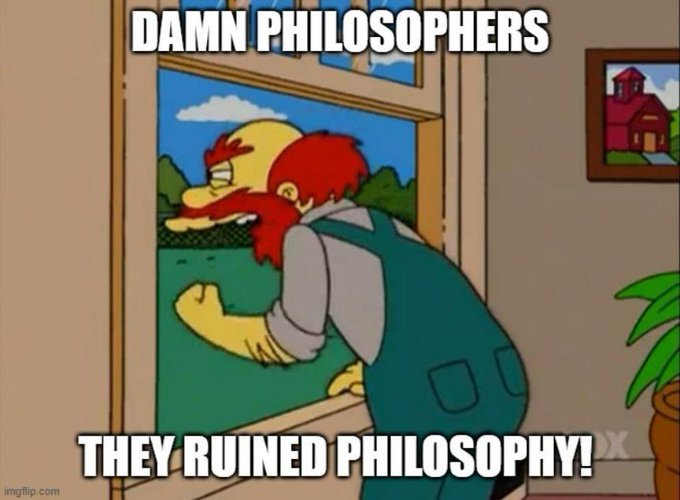

*This project has been created as part of the 42 curriculum by mtran.*

# Philosophers

## Description

In 1965, the renowned computer scientist Edsger W. Dijkstra formulated a classic synchronization problem to illustrate the challenges and pitfalls of concurrent programming: **The Dining Philosophers**.

Imagine a round table where a certain number of philosophers sit, doing one of three things: eating, thinking, or sleeping. While eating, they cannot think or sleep; while thinking, they cannot eat or sleep; and, of course, while sleeping, they cannot eat or think. 

There is a large bowl of spaghetti in the center of the table. To eat, a philosopher needs two forks (one for their left hand, and one for their right). However, there are only as many forks as there are philosophers, placed one between each pair of adjacent philosophers.

The goal of this project is to simulate this environment using **threads** and **mutexes**, ensuring that no philosopher starves, and that the simulation completely avoids issues like deadlocks, mutex storms, or data races.




### Allowed Functions
To solve this concurrent programming challenge, this project strictly adheres to using only the following C standard library functions:
* Memory & I/O: `memset`, `printf`, `malloc`, `free`, `write`
* Time Management: `usleep`, `gettimeofday`
* Multithreading (POSIX Threads): `pthread_create`, `pthread_detach`, `pthread_join`
* Mutexes: `pthread_mutex_init`, `pthread_mutex_destroy`, `pthread_mutex_lock`, `pthread_mutex_unlock`

---

## Instructions


AI Usage Statement: Artificial Intelligence (LLM) was utilized during this project to troubleshoot timestamp inaccuracies caused by microsecond drift, explain system context-switching latency, assist in optimizing mutex queries to mitigate cpu-bound mutex storms, and format this technical documentation according to school guidelines.

### Compilation
The project includes a `Makefile` that complies with the 42 standards (`-Wall -Wextra -Werror`). Simply run the following command at the root of the project to compile the executable:
```bash
make
./philo number_of_philosophers time_to_die time_to_eat time_to_sleep [number_of_times_each_philosopher_must_eat]

